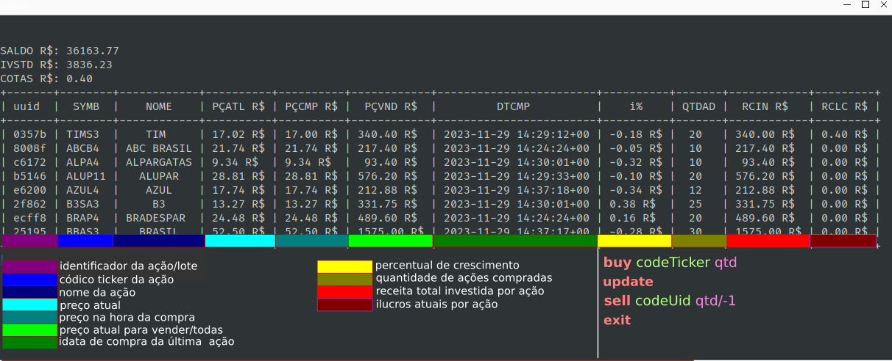

# StockSimulator

O StockSimulator é um aplicativo em Python que simula investimentos em ações. Ele oferece uma interface simples de linha de comando para realizar operações como compra, venda e atualização de ações.




## Funcionalidades Principais

``` 
# Compra
buy codigoTicker quantidade

# Venda
sell uuid  ( -1 vende todas as ações) 

# Atualizar
update

# Sair
exit
```


## Tasklist
- [ ] Adicionar funcionalidade para adicionar receita à carteira.
- [ ] Implementar notificações quando as ações atingem um percentual específico de rendimento.
- [ ] Automatizar as atualizações das informações das ações.
- [ ] Criar manual de utilização abaixo da tabela de funcionalidades.

- [X] Compra de ações
- [X] Vender ações
- [X] Atualizar dados/manual
- [X] sair


6. **Referências:**
   - Consulte as referências para entender os códigos de erro e mensagens do sistema.


## Referências
- `API-ER`: Erro na API.
- `SME-R$`: Sem saldo na carteira.
- `TRS-DN`: Transação realizada com sucesso.
- `VND-AL`: Todas as ações foram vendidas.
- `VND-ON`: Uma ação foi vendida.
- `VND-ER`: Ação não foi vendida.


## Sugestões Adicionais
- [ ] Implementar funcionalidade de gráficos para visualização do desempenho das ações.
- [ ] Adicionar suporte para diferentes bolsas de valores.
- [ ] Integrar notificações por e-mail ou mensagens para alertas importantes.

## Dependências/Execução
   - requests
   - tabulate
   - json
   - uuid
  
```
python3 init.py
```
